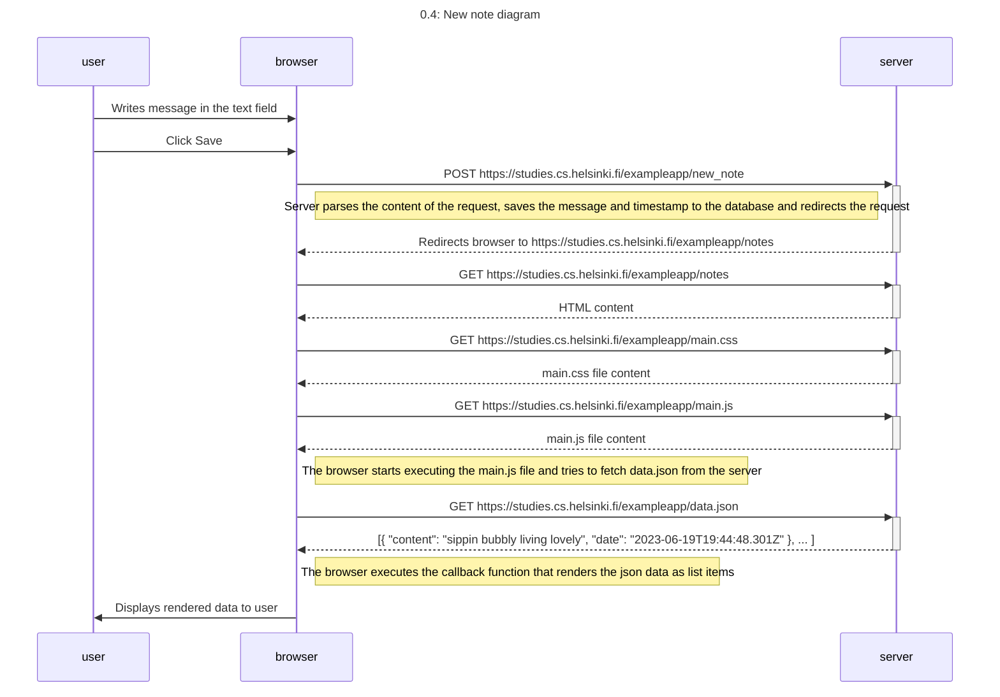

```mermaid
sequenceDiagram
title 0.4: New note diagram
participant user
participant browser
participant server

%% Submitting the new note
user ->> browser: Writes message in the text field
user ->> browser: Click Save
browser ->>+ server: POST https://studies.cs.helsinki.fi/exampleapp/new_note
Note left of server: Server parses the content of the request, saves the message and timestamp to the database and redirects the request
server -->>- browser: Redirects browser to https://studies.cs.helsinki.fi/exampleapp/notes

%% Reloading the page
browser ->>+ server: GET https://studies.cs.helsinki.fi/exampleapp/notes
server -->>- browser: HTML content

browser ->>+ server: GET https://studies.cs.helsinki.fi/exampleapp/main.css
server -->>- browser: main.css file content

browser ->>+ server: GET https://studies.cs.helsinki.fi/exampleapp/main.js
server -->>- browser: main.js file content

Note right of browser: The browser starts executing the main.js file and tries to fetch data.json from the server
browser ->>+ server: GET https://studies.cs.helsinki.fi/exampleapp/data.json
server -->>- browser: [{ "content": "sippin bubbly living lovely", "date": "2023-06-19T19:44:48.301Z" }, ... ]

Note right of browser: The browser executes the callback function that renders the json data as list items
browser ->> user: Displays rendered data to user
```
