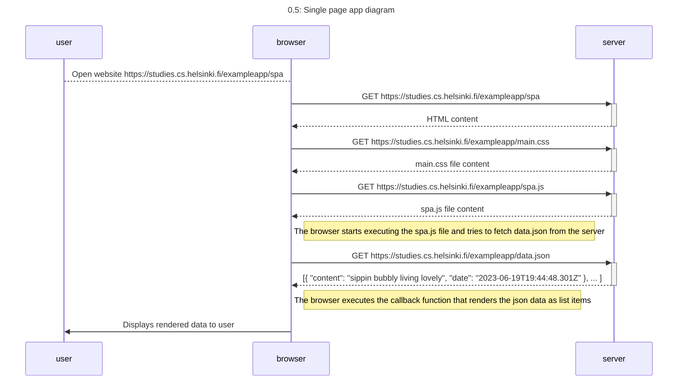

```mermaid
sequenceDiagram
title 0.5: Single page app diagram
participant user
participant browser
participant server

user --> browser: Open website https://studies.cs.helsinki.fi/exampleapp/spa

browser ->>+ server: GET https://studies.cs.helsinki.fi/exampleapp/spa
server -->>- browser: HTML content

browser ->>+ server: GET https://studies.cs.helsinki.fi/exampleapp/main.css
server -->>- browser: main.css file content

browser ->>+ server: GET https://studies.cs.helsinki.fi/exampleapp/spa.js
server -->>- browser: spa.js file content

Note right of browser: The browser starts executing the spa.js file and tries to fetch data.json from the server
browser ->>+ server: GET https://studies.cs.helsinki.fi/exampleapp/data.json
server -->>- browser: [{ "content": "sippin bubbly living lovely", "date": "2023-06-19T19:44:48.301Z" }, ... ]

Note right of browser: The browser executes the callback function that renders the json data as list items
browser ->> user: Displays rendered data to user
```
