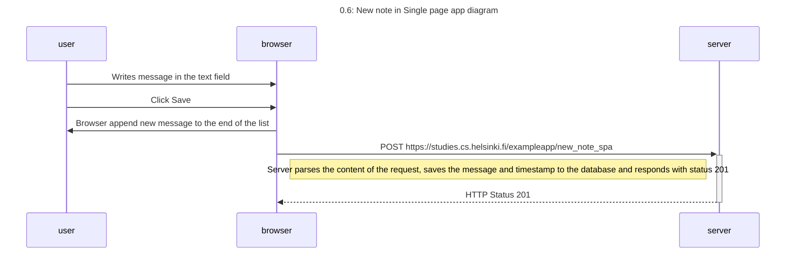

```mermaid
sequenceDiagram
title 0.6: New note in Single page app diagram
participant user
participant browser
participant server

user ->> browser: Writes message in the text field
user ->> browser: Click Save
browser ->> user: Browser append new message to the end of the list
browser ->>+ server: POST https://studies.cs.helsinki.fi/exampleapp/new_note_spa
Note left of server: Server parses the content of the request, saves the message and timestamp to the database and responds with status 201
server -->>- browser: HTTP Status 201
```
